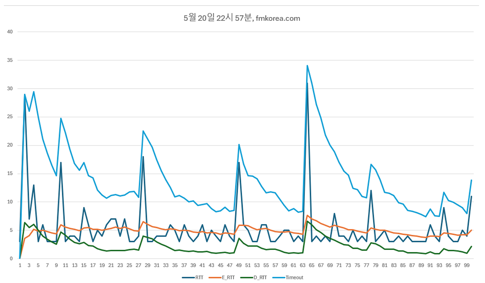
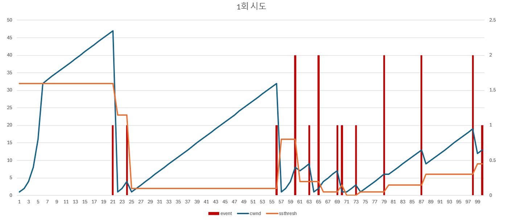

# TCP Test Programming

- _**See report for a detailed description of the program result**_

### Goal of Program
1. Calcuate TCP timeout via ping
2. TCP Congestion Control Simulation

## Description of program
### Functions

```C
// Ping target Once. Return RTT after parsing.
int ping(string target);

// Create events with 5 percent and 10 percent probability.
// This related in problem 2.
int makeEvent();

// Save the received vector data as a CSV file.
void makeCSV(...);

```

### Problem 1
- By repeating the ping(```int ping(...)```) 100 times, Estimate RTT and Dev RTT are obtained through the RTT. Through this, the time-out time is calculated.
- Extract this data to CSV. See ```report.pdf``` for results on this.

### Problem 2
- Simulate TCP Congestion Control.
- Determine whether or not **normal**, **timeout**, and **3-duplicate-ACK** occur with 5 percent and 10 percent probabilities, and adjust the ```cwnd``` and ```ssthresh``` values.
- Repeat this 100 times and extract it with CSV. See ```report.pdf``` for the results.


## Result Preview
<p align="center">
    
    <br><br><br>
    
</p>

> Please Check the report.pdf for the detail.

