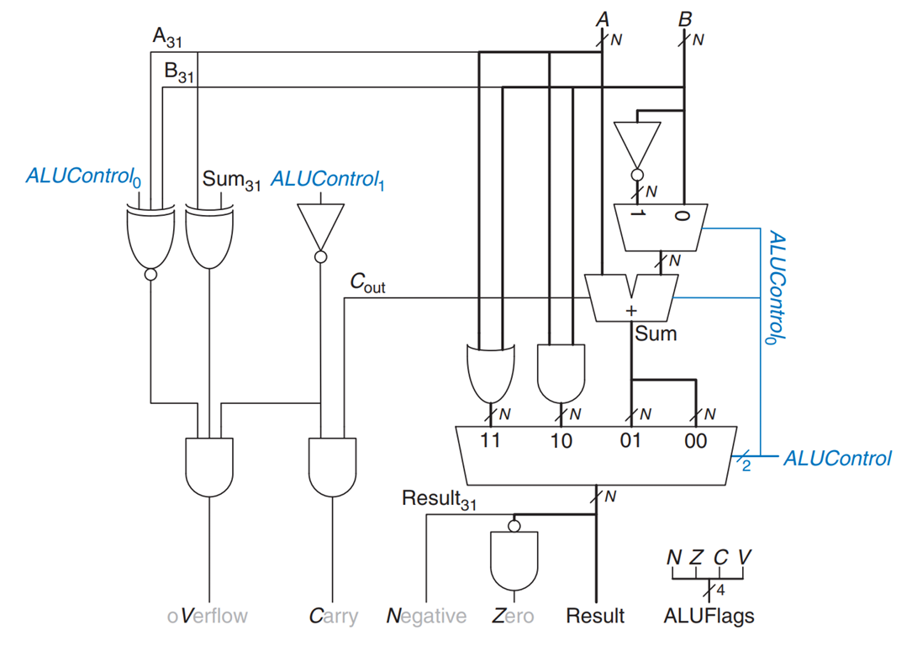
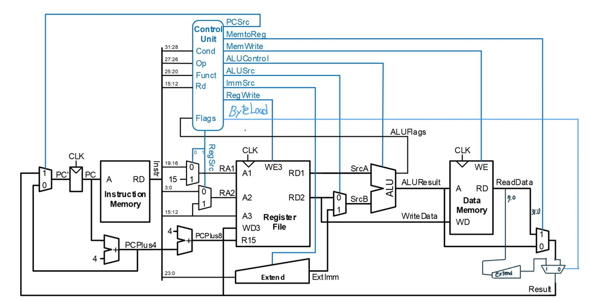

# Computer Architecture Assignments
## A1: Implement ALU
In this Assignment, We implement micro architecture ALU like below.
<p align="center">
    
</p>

- ```alu.sv``` is the code that implements alu.
- ```alu_tb.sv``` is the code that test alu implement.

<br><br>

## A2: Implementation of additional function of Single-Cycle ARM Processor
In this Assignment, the goal is to add the ```LDRB``` function to the code of the provided Single-Cycle ARM Processor SV code.

Blocks such as Extender were added to the provided circuit configuration as shown in the figure below, and refer to report.pdf for a detailed description.

<p align="center">
    
    <p><i>Improved Single-Cycle Processor</i></p>
</p>

### Caution: 
The implementation is not perfect. Modifications are needed for Byte Unit operations in memory blocks See ```report.pdf -> problem5``` for more information.

