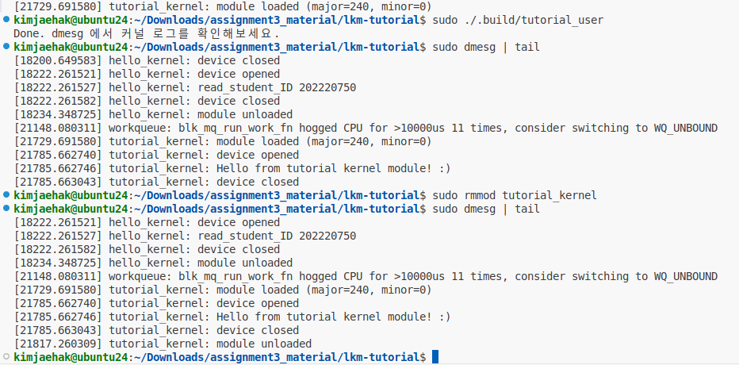

# linux_kernel_module_practice

> [!Warning]
> - 해당 프로젝트 실습 시 반드시 VM을 사용하여 수행할 것.
>   - 커널을 다루는 프로젝트임과 동시에 안정성이 확보되지 않음.
>   - WSL, Docker 등의 환경에서는 커널 모듈 개발이 어려움. 

> [!NOTE]
> 해당 프로젝트의 빌드 방법은 각 프로젝트의 `./docs/README.md`를 참고할 것.

해당 과제는 커널 모듈을 로드하고 동작을 이해하여 보는 실습으로 아래의 두 프로젝트를 포함한다.
- `./lkm-tutorial/`: 작성된 커널 모듈을 빌드하고 로드하여 ioctl의 동작을 이해한다.
- `./hello-kernel`: 과제 요구사항에 맞도록 커널 모듈을 빌드하여 예상한 동작을 확인한다.

## 과제 요구사항
hello-kernel 프로젝트를 다음 요구사항에 맞게 구현한다.
1. **`_IO`** 타입 **ioctl** 호출을 수행하면, 커널 모듈은 현재 저장된 학번을 커널로그에 출력한다.
2. **`_IOW`** 타입 **ioctl** 호출을 통해 user-space 프로그램이 학번(정수)을 전달하면, 커널 모듈은 전달받은 값을 새로운 학번으로 저장한다.
3. **`_IOR`** 타입 **ioctl** 호출을 통해 user-space 프로그램이 현재 저장된 학번을 읽어올 수 있어야 한다.
4. **`_IOWR`** 타입 **ioctl** 호출을 통해 커널 모듈과 데이터를 교환한다.
    - 주고 받는 데이터는 자유롭게 설계할것.
    - hello-kernel의 `README.md`에 명시

## 동작 예시
- `./lkm-tutorial/` 동작 예시

- `./hello-kernel` 동작 예시

